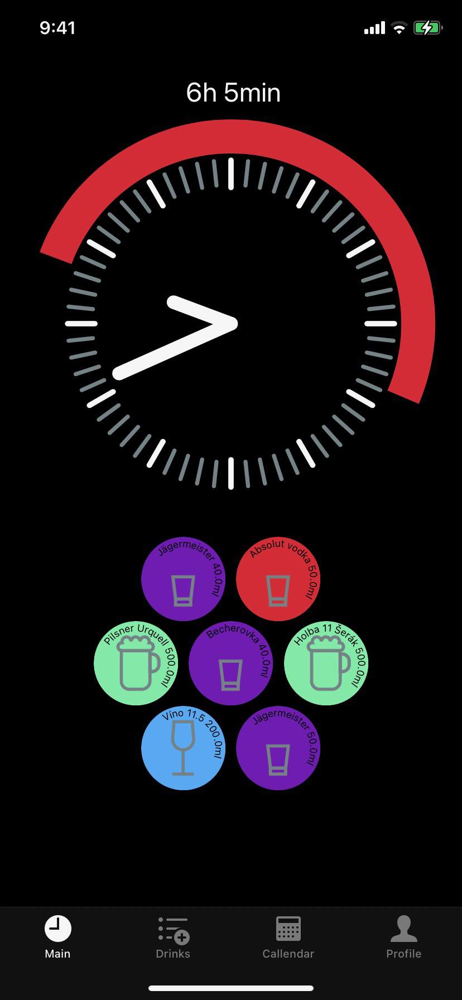
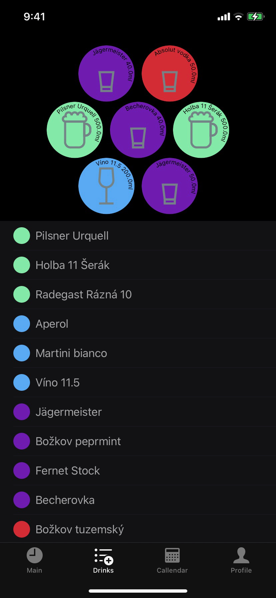
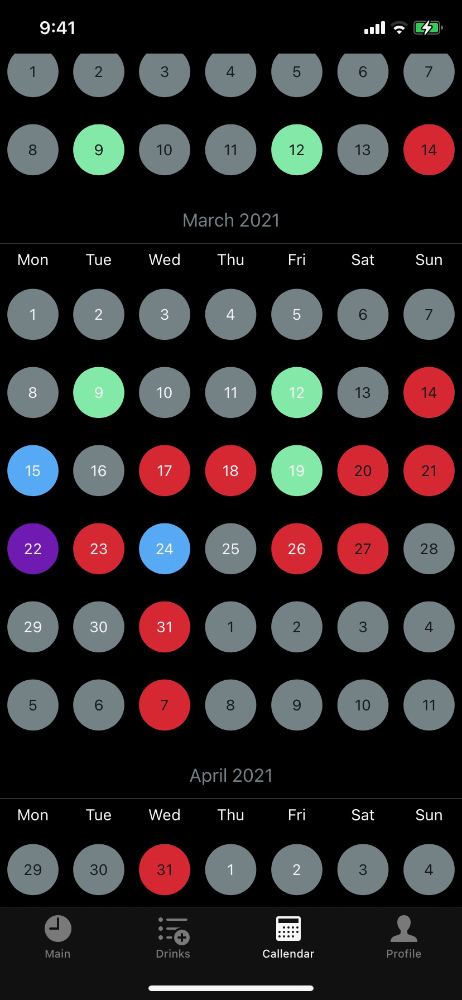
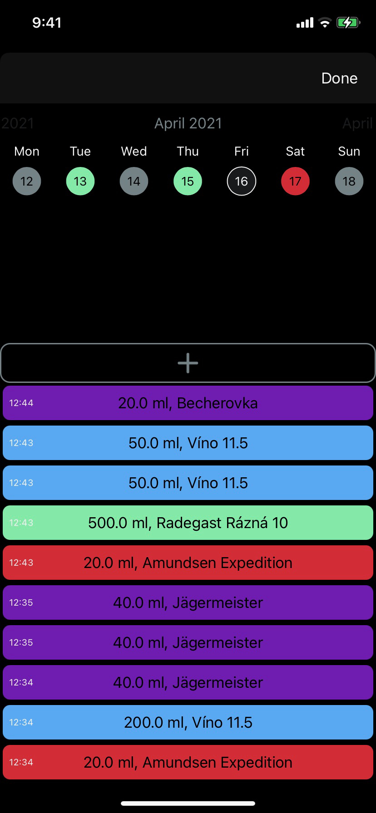
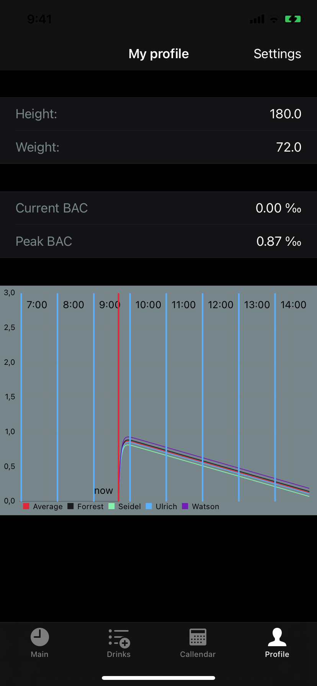
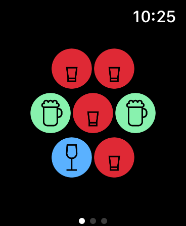
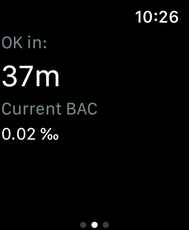
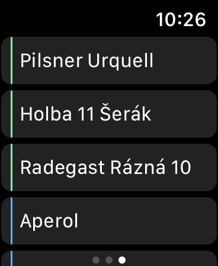

# AlkoKolik app (iOS)

|    | version | supported iOS |
| --- | ------- | --- | 
|  | v1.3 | 15.3 | 

AlkoKolik is an app for tracking your alcohol drinking habits. The app is connected with Apple HealthKit, to get your personal info and to share your drinking history

This app was created as a bachelor's work at the Brno University of Technology (BUT), Faculty of Information Technology in 2021.

## Features
- watchOS app
- estimates the time to get sober
- predicts the course of the BAC curve
- exports BAC to Apple Health (HealthKit)
- notification when you get sober
- Hypothetical mode

## Screenshots
### iOS
 |    |   
--- | --- | ---
 |    |

# watchOS
 |    |   
--- | --- | ---